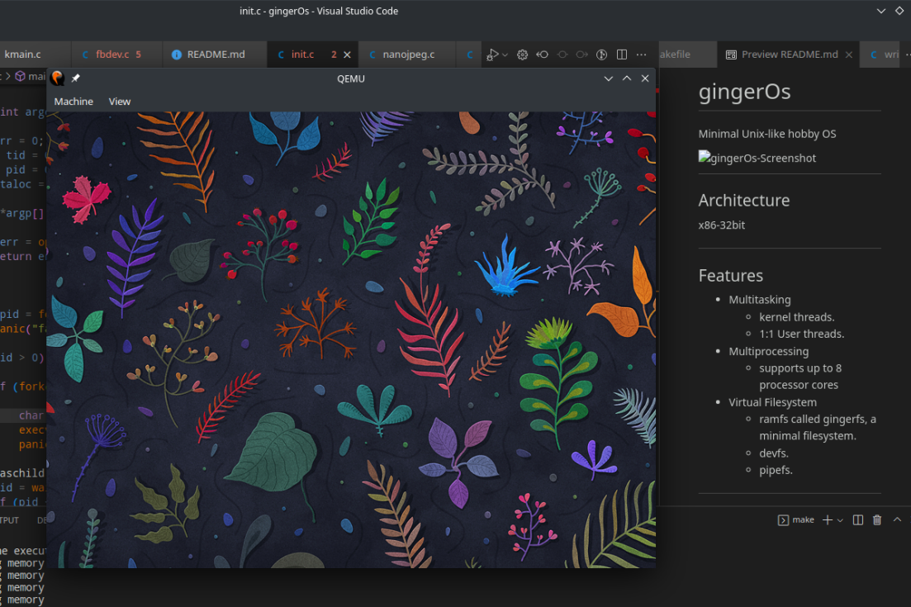
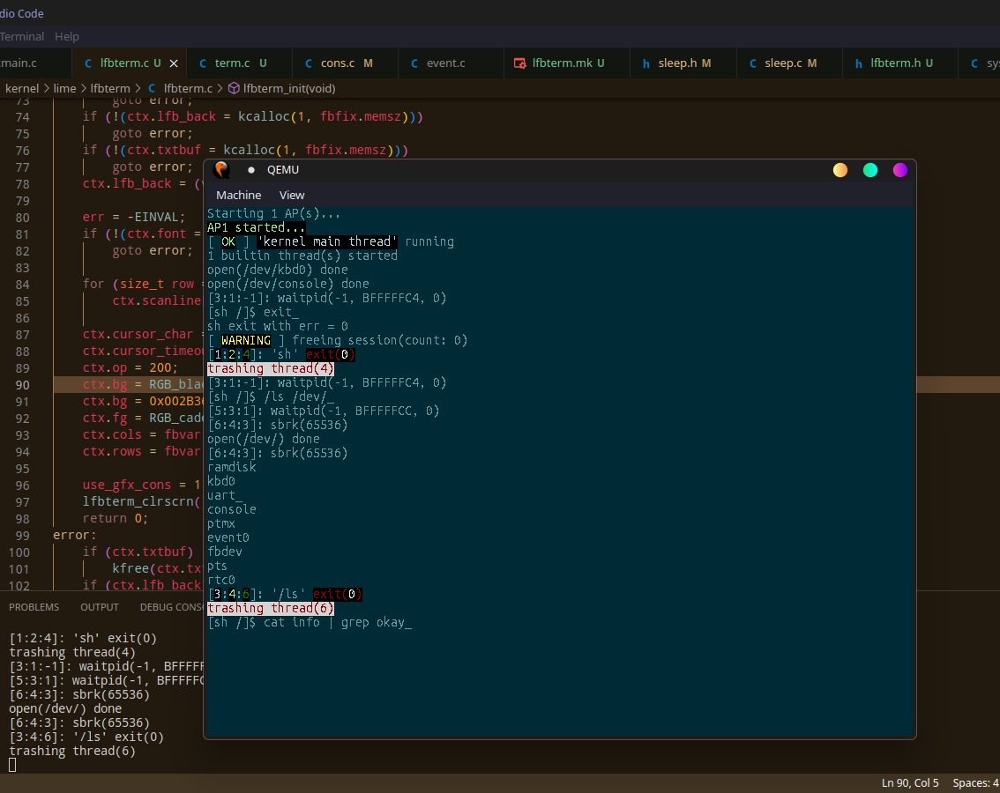
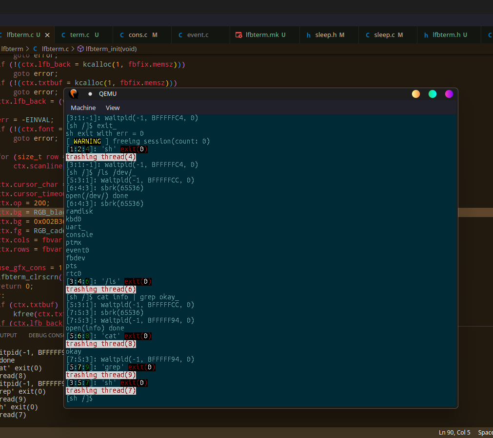

# gingerOs
Minimal Unix-like hobby OS

### Screenshot0
#

### Screenshot1
#

### Screenshot2
#

#

## Architecture
x86-32bit
#

## Features
- Multitasking
    - kernel threads.
    - 1:1 User threads.
- Multiprocessing
    - supports up to 8 processor cores.
- Memory Management
    1. Added "struct page" a new way to keep track of physical memory pages. so as to easily implement memory map sharing between processes.
        this change has later led to
        re-implementation of the physical memory allocator.
    2. Introducing the 'all-new' Physical memory allocator.
        based in part on the Linux concept of memory zones.
        This allocator adds new features to the kernel such as:
        i).     Sleeping(waiting) for memory if we run out of memory.
        ii).    Threads can now retry a memory allocation if they want to.
        iii).   Threads can decide from which pool they want to allocate memory.
                This in general increases the allocation throughput and maximizes on
                memory allocation-flexibility.
        iv).    The Memory allocator can now monitor who owns a page
                and what they're using it for.
        v). Newly implemented physical memory manager interface.
            mm_zone_t *get_mmzone(uintptr_t addr, size_t size);
            - get the zone associated with physical page address 'addr'.
            - on success, a pointer to the 'locked' zone is returned else NULL is 'return'.
            - physical page address range must all be in one memory zone, else 'NULL' is returned. 
        
        mm_zone_t *mm_zone_get(int z);
            - same as 'get_mm_zone()', except, it gets an index to the physical page as a parameter.

        *NOTE: after using the returned zone struct pointer, 
            the programmer is expected to call 'mm_zone_unlock(zone)'.
            Guess what will happen on failure to follow this simple rule? Yeah, DEADLOCK.

        int page_incr(page_t *page);
            - increase the reference count of the page

        int __page_incr(uintptr_t addr);
            - same as page_incr(), except, it takes a physical address to the page as a parameter.
        
        int page_count(page_t *page);
            - returns the reference count of the page
        
        int __page_count(uintptr_t addr);
            - same as page_count(), except, it takes a physical address to the page as a parameter.

        page_t *alloc_page(gfp_mask_t gfp);
            - allocate a single page.
        
        page_t *alloc_pages(gfp_mask_t gfp, size_t order);
            - allocate 'n' pages, where n is a power of 2.
        
        uintptr_t page_address(page_t *page);
            - get physical address of the page.

        uintptr_t __get_free_page(gfp_mask_t gfp);
        uintptr_t __get_free_pages(gfp_mask_t gfp, size_t order);
            - These two function the same way as alloc_page() and alloc_pages(),
                only differnce that they directly return the physical address of the first page allocated

        void pages_put(page_t *page, size_t order);
        void page_put(page_t *page);
            - these two are used to reliquish a reference to the page(s).

        void __pages_put(uintptr_t addr, size_t order);
        void __page_put(uintptr_t addr);
            - same as pages_put() and page_put(), only that they take 'addr' instead of 'page_t *'
- Virtual Filesystem
    - ramfs called gingerfs, a minimal filesystem.
    - devfs.
    - pipefs.
#

!NOTE:
-Code not fully tested, still a long way away from being a proper Operating System.

## REQUIREMENTS FOR BUILDING
- Latest GNU GCC cross compiler
- Latest Nasm
#

## Build
> make
#

## How to run
> make run
#
